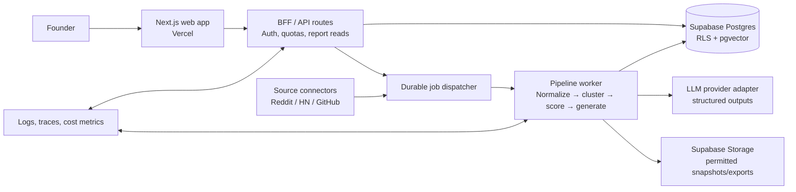

# OpportunityOS — CTO Review, Production Architecture, and MVP Roadmap

**Status:** pre-build design review — no implementation authorised

## Executive recommendation

The thesis is promising: opportunity discovery is a genuine information-overload problem, and an evidence-first product can be valuable to founders. The current specification, however, promises more certainty than the inputs can support. A large collection of complaints is not automatically a large, monetisable market; LLM-written market sizes and competitor conclusions would rapidly destroy trust.

Build a narrow **evidence-to-decision assistant**, not a universal opportunity oracle. For the first MVP, serve prospective B2B SaaS founders in one geography, initially the US, looking for workflow-automation opportunities in a small set of selected verticals. It should return a small number of traceable hypotheses, state its confidence and uncertainty, and help users decide what to validate next.

The product's durable advantage is not the chat UI or an LLM summary. It is a proprietary, continuously refreshed corpus of source-attributed pain clusters, quality controls, user feedback, and a record of which hypotheses were actually useful.

## 1. Critical product review

### What is strong

- The workflow begins with a clear, emotionally resonant job: “help me find something worth building.”
- Evidence, timing, existing alternatives, and an MVP suggestion are the right ingredients for an actionable report.
- Conversation plus durable reports is a better interface than generic business-intelligence dashboards.
- Repeated pain across independent sources can reveal underserved operational work before it appears in conventional market reports.

### What must change

| Current assumption | Why it is risky | Product decision |
| --- | --- | --- |
| One engine serves aspiring founders, existing founders, and investors. | Their decisions, legal needs, source preferences, and appetite for false positives differ. | Start with prospective B2B SaaS founders; add other personas only after product-market fit. |
| More sources means better opportunities. | More uncurated data increases spam, duplicates, licensing complexity, and confident-but-weak narratives. | Start with three sources and an explicit source-quality policy. |
| “Market size” can be generated from public chatter. | Chatter measures attention, not a defensible TAM or willingness to pay. | Present a labelled market **proxy/range** plus method and confidence; never present an invented precise TAM. |
| A single opportunity score can rank truth. | Scores hide assumptions and create false precision. | Use a ranking score internally, but expose a scorecard, confidence, evidence coverage, and disqualifiers. |
| The best signal is a complaint. | Complaints may concern a low-value edge case, a feature request, or a problem buyers will not pay to solve. | Require repetition, identifiable buyer, costly current workaround, and a plausible paid path. |
| An LLM can independently discover and verify a market. | Models can conflate sources, fabricate competitors, and amplify popular language. | The model may classify and synthesize only retrieved, cited evidence; deterministic checks gate publication. |

### Recommended MVP promise

> “Give OpportunityOS a sector and constraints. Within minutes it produces 3–5 source-linked B2B opportunity hypotheses, explains the evidence and uncertainty, and gives you the fastest validation experiment.”

The initial report should include:

1. A concise problem statement and target buyer.
2. Direct evidence excerpts with source links, dates, and source diversity.
3. The workaround and estimated cost of the problem, when evidenced.
4. Why-now signals, separated from speculation.
5. Existing alternatives and a “what we do not know” section.
6. A confidence level, disqualifiers, and a one-week validation plan.

Avoid claiming investment advice or presenting a valuation, revenue forecast, or market size as fact. Investor workflows should remain out of scope until the data, auditability, and legal posture support them.

## 2. Highest technical and operating risks

| Risk | Impact | Mitigation / decision |
| --- | --- | --- |
| Data licences, platform terms, and API changes | A core source can become commercially unusable or rate-limited. | Maintain a source registry with terms, allowed retention/use, rate limits, owner, and kill switch. Product Hunt’s API says commercial use requires contacting it; Reddit requires an agreement for commercial use beyond permitted terms/rate limits. Start only after written/verified approval where needed. [Product Hunt API](https://www.producthunt.com/v2/docs), [Reddit Data API Terms](https://redditinc.com/policies/data-api-terms) |
| Thin, biased, or duplicated evidence | False opportunities, low user trust, and poor retention. | Canonicalize, deduplicate, detect reposts/bots, weight sources, require independent authors/threads, and reject under-evidenced reports. |
| LLM hallucination and citation mismatch | The central customer promise fails. | Use structured outputs; allow the generator to cite only evidence IDs supplied in context; verify every citation, number, URL, and quote before publish; retain the exact model/prompt version. |
| “Market size” / competition overclaiming | Legal and reputational risk. | Show modelled proxy ranges only when the inputs are present; otherwise say “insufficient evidence.” Add human review for externally shareable reports. |
| Long-running, failure-prone scans | Users see stuck or duplicate reports. | Put ingestion and analysis in durable idempotent jobs with retries, dead-letter handling, per-source rate limits, and a progress state; do not run a full pipeline in a web request. |
| Cost grows with raw-text volume | Unit economics collapse before value is proven. | Filter and dedupe before embeddings or LLMs; batch cheap classification; cache by query/fingerprint; set per-scan source, token, and time budgets. |
| Privacy and prompt injection in public text | Third-party content can manipulate model behaviour; profile data is personal data. | Treat source text as untrusted data, never instructions; isolate it in structured fields; redact/minimise PII; use RLS, encryption in transit/at rest, retention/deletion workflows, and audit logs. |
| User-generated query abuse | Scraping, prompt injection, or costly scan loops. | Auth, quotas, rate limits, abuse monitoring, prompt safety rules, and a paid-plan allocation. |
| Source-specific operational limits | Scans fail at scale. | Implement adaptive backoff and source queues. GitHub’s search limits are distinct from general API limits; SEC asks callers to stay at or below 10 requests/second and identify automated traffic. [GitHub rate limits](https://docs.github.com/en/rest/using-the-rest-api/rate-limits-for-the-rest-api), [SEC developer resources](https://www.sec.gov/about/developer-resources) |

**Specific source notes**

- Google Trends should no longer be described as an “unofficial API” by default: Google now documents a Trends API Alpha. Access, quotas, and permitted use must be confirmed before it becomes an MVP dependency. [Google Trends API Alpha](https://developers.google.com/search/apis/trends)
- Product Hunt should be excluded from the first release unless commercial approval is secured.
- SEC EDGAR is valuable for public-company movement but is a weak first-release source for micro-business pain. Keep it as a later “why now” enrichment source, not a primary discovery source.
- Hacker News and GitHub skew technical. They can validate developer and software signals, but cannot stand in for broad consumer or vertical-market demand.

## 3. Production architecture

### Architectural stance

Use a **modular monolith with one asynchronous worker plane**. This preserves speed while drawing the only boundary that matters early: interactive user traffic must not depend on slow ingestion or LLM runs. Do not create microservices, a data lake, Kafka, or a separate vector database at MVP stage.

**Recommended production stack**

- **Web/API:** Next.js 15, TypeScript, Tailwind, shadcn/ui on Vercel. Server-side route handlers/BFF enforce access and expose a stable API.
- **Identity and system of record:** Supabase Auth and PostgreSQL. Enable Row Level Security on every user-owned table; service credentials exist only in server/worker environments.
- **Search and similarity:** PostgreSQL full-text search plus `pgvector`, initially in Supabase. Reassess only when retrieval quality or volume proves the need.
- **Files:** Supabase Storage for permitted raw-source snapshots and report exports; metadata remains in PostgreSQL.
- **Durable jobs:** A managed workflow/job runner behind an internal adapter (for example, Inngest or Trigger.dev) dispatches scheduled ingestion and scan stages. It must provide idempotency, retries, concurrency control, and observability. Vercel Cron may initiate schedules, but should not be the job state machine.
- **AI:** OpenAI as the primary structured-analysis provider through a small provider interface; Anthropic is a controlled fallback for individual stages. LangGraph is optional and should only be introduced if it provides measurable benefit for resumable multi-step state; a simple persisted pipeline is preferable initially.
- **Observability:** structured logs, error tracking, metrics, traces, cost/token usage per job, and alerting for failed connectors and publication gate failures.
- **Delivery:** GitHub Actions for lint/type/test/migration checks, preview deployments, and a protected production branch. Secrets belong in Vercel/Supabase/job-runner secret stores, never in `.env` committed to source control.



### Pipeline and publication gates

1. **Collect:** fetch only scoped, permitted records. Record source, canonical URL/ID, author pseudonym or hash (where permitted), timestamps, query, API version, and licence metadata.
2. **Normalise:** convert to a common schema, remove markup, classify language, redact unnecessary personal data, and fingerprint the text.
3. **Quality filter:** reject spam, deleted records, unsupported languages, too-short content, duplicates, and likely reposts. Preserve the rejection reason.
4. **Extract:** small/cheap structured classification yields pain statement, actor, workflow, workaround, severity cues, vertical, and tags. It does not create an opportunity yet.
5. **Cluster:** combine semantically related signals only after embedding plus lexical checks. Store cluster membership and a representative evidence set.
6. **Score:** calculate a deterministic candidate score from repeatability, source diversity, recency/momentum, severity/workaround, buyer clarity, competition evidence, and feasibility. Apply penalties for weak or single-source clusters.
7. **Synthesize:** retrieve a bounded, diverse evidence pack. The model produces a report using a strict schema. Every substantive statement must cite evidence IDs or be labelled as a hypothesis.
8. **Verify and publish:** validate schema, citations, source accessibility, minimum evidence rules, unsafe claims, and duplicate report fingerprints. Failed reports are held for retry/review, never silently delivered.
9. **Learn:** capture saves, dismissals, feedback, outbound validation results, and paid conversion. These become labelled data for score calibration, not an automatic truth source.

### Scoring design

Do **not** use `Pain × Market × Timing × AI Advantage ÷ Competition`. Multiplication/division produces unstable results, rewards unmeasured estimates, and makes a near-zero competitor estimate dominate the ranking.

Use independently auditable 0–100 sub-scores, then a weighted score with confidence and penalties:

```
candidate_score =
  0.28 × evidence_strength +
  0.20 × pain_and_workaround +
  0.18 × buyer_clarity +
  0.14 × momentum +
  0.10 × solution_feasibility +
  0.10 × commercial_signal −
  weak_evidence_penalty − saturation_penalty
```

`confidence` is separate: it measures source diversity, evidence recency, agreement, and retrieval coverage. A strong-looking idea can rank high with low confidence; it should then be shown as a hypothesis with a validation experiment, not a recommendation.

## 4. Data model

Use UUID primary keys, `created_at` / `updated_at` timestamps, UTC, and `jsonb` only for bounded provider-specific payloads. Add an immutable `events`/audit trail for model and report publication decisions.

| Domain | Core tables | Purpose |
| --- | --- | --- |
| Identity | `profiles`, `user_preferences`, `organizations`, `organization_members` | Start with personal workspaces but avoid a later migration by making ownership organization-based. |
| Sources | `source_connectors`, `source_documents`, `source_snapshots`, `ingestion_runs` | Store provenance, licence/retention metadata, hashes, raw pointers, and ingestion health. |
| Signals | `signals`, `signal_embeddings`, `signal_classifications`, `signal_clusters`, `cluster_memberships` | Separate raw data from derived analysis; every derivative traces to source documents. |
| Opportunities | `opportunity_candidates`, `opportunity_scores`, `opportunity_reports`, `report_evidence`, `report_versions` | Keep a candidate distinct from its generated report and preserve versioned scoring/report lineage. |
| User workflow | `scans`, `scan_filters`, `saved_opportunities`, `feedback`, `validation_experiments` | Make scans asynchronous; support a future validation loop without a dashboard. |
| Operations | `jobs`, `job_attempts`, `model_runs`, `usage_ledger`, `audit_events` | Idempotency, replay, cost control, monitoring, and compliance evidence. |

### Key relationships and constraints

- `source_documents` has a unique `(source_connector_id, external_id)` and a content hash to deduplicate cross-source copies.
- `signals` belongs to exactly one source document; a cluster has many signals through `cluster_memberships`.
- `report_evidence` links a report claim/section to exact signal IDs and excerpt offsets. This is the provenance backbone.
- `opportunity_scores` and `report_versions` are append-only; a report records the score/model/prompt/retrieval version used to publish it.
- `scans` uses a client-generated idempotency key and records `queued | running | completed | failed | cancelled`; it never stores the full report as its only output.
- Row Level Security permits a user only to access rows owned by their organization. Connector secrets, raw unrestricted content, and operational logs are never directly readable from the browser.

## 5. API plan

The browser talks only to the Next.js BFF. The BFF validates session, organization access, request quotas, and schemas. Internal worker endpoints are authenticated service-to-service and are not public APIs.

| Endpoint | Method | Purpose |
| --- | --- | --- |
| `/api/v1/profile` | `GET`, `PATCH` | Read/update the narrow onboarding preferences. |
| `/api/v1/scans` | `POST`, `GET` | Queue a bounded scan; list the user’s scans. POST accepts `Idempotency-Key`. |
| `/api/v1/scans/{scanId}` | `GET` | Return status, stage, safe progress, error code, and resulting report IDs. |
| `/api/v1/opportunities` | `GET` | Query completed reports by scope, freshness, saved state, and confidence. No analytics dashboard semantics. |
| `/api/v1/opportunities/{reportId}` | `GET` | Return one versioned, source-attributed report. |
| `/api/v1/opportunities/{reportId}/save` | `PUT`, `DELETE` | Save/remove an opportunity. |
| `/api/v1/opportunities/{reportId}/feedback` | `POST` | Capture usefulness, reason, and optional validation outcome. |
| `/api/v1/exports/{reportId}` | `POST` | Generate a short-lived signed report export after authorisation. |
| `/internal/jobs/*` | internal only | Dispatch/retry pipeline stages; require signed service authentication and idempotency. |

**API rules:** JSON schema validation at every boundary; pagination; opaque IDs; typed error codes; no raw provider payloads to clients; rate limits per user and IP; audit records for exports and administrative actions. Use webhooks/server-sent updates only for an individual scan’s state, with polling as a resilient fallback.

## 6. MVP implementation roadmap

The sequence is intentionally outcome-driven. Each milestone ends with a decision gate; a feature is not “done” merely because it is deployed.

| Phase | Duration | Deliverable | Exit gate |
| --- | ---: | --- | --- |
| 0. Discovery and legal readiness | 1 week | 15–20 founder interviews; select one initial vertical/use case; source inventory; confirm commercial rights/retention; define a manually reviewed report rubric. | At least 10 target users agree the sample report would change their next action; approved source plan. |
| 1. Thin vertical slice | 1–2 weeks | Landing page, auth, onboarding, organization/RLS base, report reader, scan status flow, audit/usage skeleton. Use a seeded or manually curated evidence set. | Five users can request, read, save, and explain a report without assistance. |
| 2. Evidence engine | 2 weeks | Two permitted source connectors (recommend Reddit only after usage approval plus Hacker News or GitHub), normalisation, dedupe, immutable provenance, source health and queue controls. | At least 95% of stored source documents retain a valid provenance record; zero duplicate publication in test corpus. |
| 3. Opportunity pipeline | 2 weeks | Structured extraction, clustering, deterministic scoring, bounded retrieval, AI report generation, citation/schema verification, failure states. | 100% of published report claims in the test set have valid citations or an explicit hypothesis label; human rubric passes at least 70% of reviewed reports. |
| 4. Closed beta | 2 weeks | 20 founder cohort, report feedback, save/dismiss loop, validation-experiment template, cohort analytics for the team (not customer dashboards), cost and reliability alerts. | ≥40% obtain a report they rate “worth investigating”; ≥30% return in week two; scan cost and p95 completion meet agreed budget. |
| 5. Monetisation test and hardening | 2–3 weeks | Usage limits, billing integration if validated, secure exports, deletion/retention controls, backups/restore drill, abuse controls, incident runbook. | At least five users demonstrate willingness to pay or complete a pre-payment test; no unresolved P0/P1 security or provenance defects. |

### First release scope

**Include:** authentication; onboarding constrained to a few verticals; a manual “scan” action with tight budgets; 3–5 reports; source citations; saved reports; feedback; a one-week validation plan; operational monitoring.

**Defer:** all-source ingestion, investor mode, real-time monitoring, competitor databases, exact TAM calculation, team collaboration, autonomous agents, broad consumer scanning, dashboards, and a mobile app.

### Definition of done before paid launch

- Every report is reproducible to its exact evidence, score version, model/prompt version, and generated timestamp.
- No report says it “found 4,500 complaints” unless the database can substantiate that count under a documented query and retention policy.
- Report citations open to a permitted source or explain why the source is no longer accessible.
- A failed source or model call produces a transparent status/error, not fabricated completeness.
- Cost, latency, source health, safety events, and publish-gate failures are observable.
- Data deletion, access control, backups, and incident ownership have been tested.

## Approval requested before implementation

Before code begins, approve or adjust these four choices:

1. Initial customer: prospective B2B SaaS founders, not investors or all entrepreneur segments.
2. Initial wedge: US workflow-automation opportunities in selected verticals.
3. Initial sources: only two permitted sources plus manual/curated seed evidence; defer Product Hunt and SEC as primary discovery feeds.
4. Product truth standard: source-linked hypotheses with confidence and validation steps, never unsupported market facts or investment recommendations.
