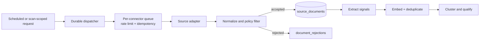

# OpportunityOS MVP — Final Technical Design

**Status:** approved product direction; design complete; implementation is explicitly pending approval.

## Product contract

OpportunityOS is an **evidence-backed founder research assistant**, not an opportunity prediction engine.

Its initial user is an early-stage B2B SaaS founder. A scan produces a versioned **Founder Opportunity Report**: a concise, source-linked hypothesis that helps a founder decide what to validate next.

Every report must contain:

- Problem
- Evidence
- Buyer
- Current workaround
- AI advantage
- MVP suggestion
- Validation experiment
- Confidence

The MVP source set is Reddit, Hacker News, GitHub Issues, and job postings. Product Hunt, SEC EDGAR, and Google Trends are out of scope.

## 1. Final database schema

### Conventions

- PostgreSQL in Supabase; UUID primary keys; all timestamps are `timestamptz` in UTC.
- All user-owned data belongs to an organization. The MVP creates one personal organization per user; this avoids a future ownership migration.
- User-facing tables have Supabase Row Level Security enabled. Connector credentials and worker-only data are never readable by browser roles.
- Raw content is stored only when source terms permit it. Otherwise retain minimal permitted metadata, a source URL/ID, checksum, excerpt, and retention deadline.
- Derived records retain source lineage and are append-only where reproducibility matters.

### Identity and access

| Table | Key fields | Purpose / constraints |
| --- | --- | --- |
| `profiles` | `id` (FK `auth.users`), `display_name`, `onboarding_completed_at` | Public profile extension; one row per authenticated user. |
| `organizations` | `id`, `name`, `created_by` | Personal workspace now; team workspace-ready later. |
| `organization_members` | `organization_id`, `user_id`, `role` | Unique `(organization_id, user_id)`; roles `owner`, `member`. |
| `founder_preferences` | `organization_id`, `industries`, `buyer_types`, `geography`, `risk_appetite`, `goals` | One current preference set per organization. Restrict controlled values, rather than free-text filters only. |

### Source registry and ingestion

| Table | Key fields | Purpose / constraints |
| --- | --- | --- |
| `source_connectors` | `id`, `key`, `enabled`, `terms_url`, `retention_policy`, `rate_limit_config`, `health_status` | Admin-controlled registry: `reddit`, `hacker_news`, `github_issues`, `job_postings`. No secrets in this table. |
| `ingestion_runs` | `id`, `connector_id`, `scope`, `status`, `cursor_in`, `cursor_out`, `started_at`, `completed_at`, `records_seen`, `records_accepted`, `error_code` | One idempotent connector run. Unique idempotency key prevents duplicate work. |
| `source_documents` | `id`, `connector_id`, `external_id`, `canonical_url`, `published_at`, `fetched_at`, `author_ref`, `title`, `content_excerpt`, `content_storage_path`, `content_hash`, `language`, `deleted_at`, `retention_expires_at`, `metadata` | Immutable evidence item. Unique `(connector_id, external_id)` and unique canonical URL where available. `author_ref` is a salted pseudonym/hash, not a plain user name unless terms permit. |
| `source_document_versions` | `id`, `source_document_id`, `content_hash`, `storage_path`, `fetched_at`, `change_reason` | Optional permitted snapshot history; supports source drift and reproducibility. |
| `document_rejections` | `id`, `ingestion_run_id`, `external_id`, `reason_code`, `detail` | Records rejected spam, duplicates, policy conflicts, or invalid records without retaining unnecessary content. |

### Signals, clusters, and reports

| Table | Key fields | Purpose / constraints |
| --- | --- | --- |
| `signals` | `id`, `source_document_id`, `signal_type`, `problem_statement`, `actor`, `buyer_hint`, `workflow`, `workaround`, `pain_indicators`, `industry_tags`, `classification_status`, `classifier_version` | A structured extraction from exactly one source document. `signal_type` includes `pain`, `hiring`, `technology_shift`, `workaround`. |
| `signal_embeddings` | `signal_id`, `embedding`, `embedding_model`, `content_hash` | `pgvector` embedding. Unique `(signal_id, embedding_model, content_hash)` to prevent stale reuse. |
| `opportunity_clusters` | `id`, `fingerprint`, `title`, `scope`, `status`, `representative_signal_id`, `created_at`, `last_observed_at` | A normalized hypothesis topic, not a published conclusion. `status`: `candidate`, `qualified`, `rejected`, `published`. |
| `cluster_memberships` | `cluster_id`, `signal_id`, `similarity`, `assigned_by`, `created_at` | Unique `(cluster_id, signal_id)`. Retains automated/manual assignment provenance. |
| `cluster_assessments` | `id`, `cluster_id`, `score_version`, `evidence_strength`, `pain_strength`, `buyer_clarity`, `workaround_strength`, `momentum`, `ai_advantage`, `commercial_signal`, `saturation_penalty`, `confidence`, `total_score`, `rationale`, `created_at` | Append-only deterministic assessment; never overwrite an evaluated score. |
| `founder_opportunity_reports` | `id`, `organization_id`, `scan_id`, `cluster_id`, `version`, `status`, `title`, `problem`, `buyer`, `current_workaround`, `ai_advantage`, `mvp_suggestion`, `validation_experiment`, `confidence`, `confidence_rationale`, `unknowns`, `model_run_id`, `published_at` | Canonical report. Unique `(organization_id, cluster_id, version)`. `status`: `draft`, `verified`, `published`, `withheld`, `superseded`. |
| `report_evidence` | `id`, `report_id`, `section`, `source_document_id`, `signal_id`, `claim_text`, `excerpt`, `excerpt_start`, `excerpt_end`, `evidence_role`, `created_at` | A report cannot publish without evidence rows for problem, buyer/workaround where present, and confidence. `evidence_role`: `primary`, `corroborating`, `counterevidence`. |

### User scans, feedback, and operational records

| Table | Key fields | Purpose / constraints |
| --- | --- | --- |
| `scans` | `id`, `organization_id`, `requested_by`, `idempotency_key`, `filters`, `status`, `stage`, `progress`, `requested_at`, `completed_at`, `error_code`, `error_detail` | User request lifecycle: `queued`, `running`, `completed`, `failed`, `cancelled`. Unique `(organization_id, idempotency_key)`. |
| `scan_reports` | `scan_id`, `report_id`, `rank`, `included_reason` | Which versioned reports were returned by a scan. Unique `(scan_id, report_id)`. |
| `saved_reports` | `organization_id`, `report_id`, `saved_at` | User save state; unique pair. |
| `report_feedback` | `id`, `organization_id`, `report_id`, `rating`, `outcome`, `reason_code`, `comment`, `created_at` | `rating` 1–5; `outcome` includes `investigating`, `customer_interviews`, `rejected`, `building`. Do not use as autonomous retraining truth without review. |
| `validation_experiments` | `id`, `organization_id`, `report_id`, `hypothesis`, `method`, `success_criterion`, `status`, `result`, `created_at` | Founder-owned execution record. MVP UI can read it later; creation may initially be simple report feedback. |
| `jobs` | `id`, `kind`, `idempotency_key`, `payload_ref`, `status`, `scheduled_at`, `started_at`, `completed_at` | Durable worker state mirrored from the job runner; unique `(kind, idempotency_key)`. |
| `job_attempts` | `id`, `job_id`, `attempt_number`, `status`, `started_at`, `completed_at`, `error_code`, `trace_id` | Retry and observability history. |
| `model_runs` | `id`, `purpose`, `provider`, `model`, `prompt_version`, `input_fingerprint`, `output_fingerprint`, `token_in`, `token_out`, `cost_usd`, `latency_ms`, `status`, `trace_id`, `created_at` | Full reproducibility and cost accounting. Source text remains in the source tables; do not duplicate it in logs. |
| `usage_ledger` | `id`, `organization_id`, `metric`, `quantity`, `period_start`, `period_end`, `metadata` | Quotas and later billing without coupling scans to a billing provider. |
| `audit_events` | `id`, `actor_type`, `actor_id`, `organization_id`, `action`, `entity_type`, `entity_id`, `metadata`, `created_at` | Security-sensitive, publish, export, and admin events. Append-only. |

### Required indexes and data controls

- B-tree: timestamps/statuses on `scans`, `jobs`, `ingestion_runs`, `source_documents`; foreign keys on every relationship; `(organization_id, published_at DESC)` on reports.
- GIN: `filters`, bounded `metadata`, and controlled tag arrays where query patterns need them.
- Vector: HNSW/IVFFlat on `signal_embeddings.embedding`, only after a representative test corpus establishes recall and latency targets.
- Full text: title/excerpt fields, with language-aware configuration where supported.
- Retention job: safely deletes or purges `content_storage_path` when `retention_expires_at` passes, preserving only allowed minimal audit metadata.

## 2. API contracts

### Contract rules

- Public endpoints live under `/api/v1`; only the Next.js backend-for-frontend exposes them.
- Authentication uses Supabase session credentials. Every request resolves an active organization and RLS enforces ownership.
- Input/output schemas are versioned and validated. JSON responses use ISO 8601 UTC timestamps and opaque UUIDs.
- Mutating endpoints require `Idempotency-Key`; list endpoints use a cursor and bounded page size.
- Errors follow `{ error: { code, message, request_id, retryable } }`; raw provider details never reach the client.

### Shared report resource

```json
{
  "id": "uuid",
  "version": 1,
  "status": "published",
  "title": "AI intake assistant for independent dental practices",
  "problem": "…",
  "buyer": { "role": "practice manager", "organization": "independent dental practice" },
  "current_workaround": "…",
  "ai_advantage": "…",
  "mvp_suggestion": "…",
  "validation_experiment": { "goal": "…", "method": "…", "success_criterion": "…" },
  "confidence": { "level": "medium", "score": 68, "rationale": "…", "unknowns": ["…"] },
  "evidence": [
    { "id": "uuid", "section": "problem", "source_type": "reddit", "source_url": "https://…", "published_at": "…", "excerpt": "…", "role": "primary" }
  ],
  "published_at": "2026-07-16T00:00:00Z"
}
```

`confidence.level` is one of `low`, `medium`, `high`. The numeric score is a ranking input, not a predicted probability or recommendation.

### Public endpoints

| Endpoint | Request | Response / behavior |
| --- | --- | --- |
| `GET /api/v1/me` | none | Current profile, active organization, onboarding state, and allowed scan allocation. |
| `PATCH /api/v1/preferences` | `industries`, `buyer_types`, `geography`, `risk_appetite`, `goals` | Validated saved preference resource. |
| `POST /api/v1/scans` | `scope` (`industry`, `buyer_type`, `geography`, optional `problem_hints`), optional `freshness_days` | Validates quota and returns `202` with `{ id, status: "queued" }`; dispatches an idempotent scan job. |
| `GET /api/v1/scans` | cursor, limit, status | Paginated scan summaries. |
| `GET /api/v1/scans/{scanId}` | none | Status, safe stage/progress, error if applicable, and report summaries only once completed. |
| `POST /api/v1/scans/{scanId}/cancel` | none | `202`; cancellation is best effort and never deletes completed evidence. |
| `GET /api/v1/reports` | cursor, limit, `industry`, `confidence`, `saved`, `fresh_since` | Paginated report cards. No generic analytics/dashboard API. |
| `GET /api/v1/reports/{reportId}` | none | Full shared report resource and provenance evidence. |
| `PUT /api/v1/reports/{reportId}/save` | none | `204`; creates save state idempotently. |
| `DELETE /api/v1/reports/{reportId}/save` | none | `204`; removes save state idempotently. |
| `POST /api/v1/reports/{reportId}/feedback` | `rating`, `outcome`, `reason_code`, optional `comment` | `201` feedback resource; rate-limited. |
| `POST /api/v1/reports/{reportId}/export` | `format: "pdf"` | `202`; creates an authorized export job and later exposes a short-lived signed URL. |

### Worker-only contracts

`/internal/v1/jobs/dispatch`, `/internal/v1/ingestion/*`, and `/internal/v1/pipeline/*` are not browser-accessible. They authenticate with a signed service identity, enforce job idempotency, record a trace ID, and return no source secrets or raw unrestricted content.

Events are internal domain events, not a public event bus: `scan.requested`, `source.ingestion.requested`, `document.accepted`, `cluster.qualified`, `report.generation.requested`, `report.verified`, and `report.published`.

## 3. Folder structure

```text
opportunityos/
├── apps/
│   └── web/                         # Next.js 15 app; UI and BFF only
│       ├── app/
│       │   ├── (marketing)/
│       │   ├── (app)/                # authenticated conversation/report experience
│       │   └── api/v1/               # thin public route handlers
│       ├── components/
│       │   ├── report/
│       │   ├── scan/
│       │   └── ui/
│       └── lib/                      # client-safe helpers only
├── packages/
│   ├── contracts/                    # schemas, request/response types, error codes
│   ├── domain/                       # entities, policies, score rules; no framework imports
│   ├── database/                     # migrations, generated types, repositories, RLS tests
│   ├── connectors/                   # source adapter interface + source implementations
│   │   ├── reddit/
│   │   ├── hacker-news/
│   │   ├── github-issues/
│   │   └── job-postings/
│   ├── pipeline/                     # ingestion, quality, extraction, cluster, report stages
│   ├── ai/                           # provider adapter, structured schemas, prompts, evaluators
│   ├── jobs/                         # job definitions, schedules, retry policies
│   ├── observability/                # logging, tracing, cost metrics, redaction
│   └── config/                       # validated server configuration; never secret values
├── supabase/
│   ├── migrations/
│   ├── seed/
│   └── tests/                        # RLS and database policy tests
├── tests/
│   ├── fixtures/                     # permitted synthetic/de-identified source fixtures
│   ├── integration/
│   ├── e2e/
│   └── evals/                        # golden reports/citation and quality evaluations
├── docs/
│   ├── adr/                          # architectural decision records
│   ├── source-policies/
│   └── runbooks/
├── .github/workflows/
└── README.md
```

Boundary rules:

- `apps/web` does not call third-party sources or an LLM directly.
- `connectors` returns normalized source records, never report-shaped objects.
- `pipeline` owns state transitions; it calls `ai` through an interface and persists through `database` repositories.
- UI uses only `contracts`; internal database tables are not API types.
- Prompts, model schemas, and scoring versions are versioned alongside evaluation fixtures.

## 4. Ingestion architecture

### Source posture

Each source uses the same adapter contract but has its own permissions, query strategy, rate limiter, retention policy, and health monitor. The system must be able to disable one connector without breaking scans or reports.

| Connector | MVP signal | Collection approach | Special requirement |
| --- | --- | --- | --- |
| Reddit | Repeated workflow complaints, manual-work frustrations, buyer language | Approved API queries scoped by sector/community and recency | Enable only under terms/usage that cover the MVP's commercial use and retention. |
| Hacker News | Emerging technical pain, tooling shifts, developer commentary | Official/publicly supported API/search usage, bounded by topic and time | Treat as developer-skewed corroboration, not broad market proof. |
| GitHub Issues | Explicit product gaps, bugs, missing workflows, manual integrations | Public repositories selected by topic; issue/comment retrieval with a rate-aware queue | Use only public issues and respect GitHub rate limits/terms; do not ingest private data. |
| Job postings | Hiring for repetitive operations, compliance work, or systems integration | **Provider/approved feed to be selected before connector build**; normalise job/firm/date/location/skills | No generic scraping. Record provider licence, retention, and attribution requirements in `source_connectors`. |

### Execution flow



### Reliability requirements

- **No synchronous scan ingestion.** A scan starts a durable job and returns immediately.
- **Idempotency:** a connector request key includes source, normalized scope, time window, and cursor. Upserts are safe under retry.
- **Rate control:** independent token-bucket limiter and bounded concurrency per connector; honour backoff/retry headers; circuit-break after repeated failures.
- **Incremental collection:** use cursors/watermarks, not repeated full-history fetches. Reconciliation runs detect gaps.
- **Quality control:** URL/external-ID dedupe first, content hash second, semantic near-duplicate suppression third. Keep different source authors as corroboration when they are genuinely independent.
- **Policy control:** each connector declares permitted fields, retention period, user-visible attribution format, and whether raw snapshots are allowed. A policy mismatch blocks storage/publishing.
- **Observability:** source freshness, fetch success rate, accepted/rejected ratio, latency, quota consumption, and new-signal volume alert the team to drift.

## 5. AI pipeline design

### Design principles

The AI pipeline synthesizes evidence; it does not invent market facts, browse arbitrary content, or decide alone that a business should be built. Public-source text is untrusted data, never executable instruction.

All model outputs are strict structured objects validated before persisting. The report generator receives only a curated evidence pack with opaque evidence IDs. A claim without an evidence ID is either rejected or explicitly classified as a hypothesis/unknown.

### Stages

| Stage | Input | Output | Guardrail |
| --- | --- | --- | --- |
| 1. Extract | Normalized source document | `signal` fields: problem, actor, workflow, workaround, pain cues, buyer hint, tags | Small schema; source text enclosed as untrusted content; model cannot write a report. |
| 2. Quality/triage | Signal + document metadata | `accept`, `reject`, or `needs_review`, with reason | Heuristics precede model where possible; automated rejection preserves audit reason. |
| 3. Cluster | Embeddings + lexical similarity + scope | Cluster assignment/candidate | Semantic similarity alone cannot join clusters; shared buyer/workflow/pain terms are required. |
| 4. Assess | Cluster metrics and selected evidence | Deterministic sub-scores, confidence, disqualifiers | Weighted rules calculate ranking; the model may explain, not calculate or override it. |
| 5. Retrieve evidence | Qualified cluster | Diverse evidence pack | Enforce source/date/author diversity and a token budget; include counterevidence where available. |
| 6. Draft report | Evidence pack + score + user scope | Required Founder Opportunity Report fields with evidence IDs | JSON schema; minimum evidence per claim; no uncited factual counts or TAM claims. |
| 7. Verify | Draft + original evidence | pass, withhold, or revision instructions | Citation URL/ID/excerpt check, claim coverage, format, safety, and duplication checks. |
| 8. Publish | Verified report | Immutable version and user-visible report | Publication gate persists model/prompt/retrieval/score versions and audit event. |

### Qualification and confidence

A cluster qualifies for generation only when it has:

- a clear B2B actor/buyer hypothesis;
- repeated pain or workflow evidence from at least two independent documents;
- a credible current workaround or explicit “unknown” status;
- an evidence pack containing source links and dates; and
- no hard policy/quality rejection.

Initial confidence level is evidence-based, not model confidence:

| Level | Rule |
| --- | --- |
| High | At least 5 independent documents, at least 2 source types, current evidence, clear buyer and workaround, and no substantial counterevidence. |
| Medium | At least 3 independent documents, a plausible buyer/workaround, but limited source diversity, freshness, or commercial signal. |
| Low | Evidence is thin, conflicting, or concentrated in one source. May be shown only as a clearly labelled exploratory hypothesis. |

### Report score

Use a documented, versioned weighted ranking score:

```text
total = 0.28 evidence_strength
      + 0.20 pain_and_workaround
      + 0.18 buyer_clarity
      + 0.14 momentum
      + 0.10 ai_advantage
      + 0.10 commercial_signal
      - weak_evidence_penalty
      - saturation_penalty
```

The product displays the confidence rationale and evidence quality, not this formula as a prediction of success.

### Model/provider operation

- OpenAI is the primary model provider; Anthropic is a feature-flagged fallback behind a provider interface.
- Use the smallest model that passes each stage's evaluation; extraction and report generation have separate model settings and budgets.
- Prompts, output schemas, model names, temperatures, and evaluation datasets are versioned.
- A daily evaluation suite tests structured extraction, citation alignment, unsupported-claim rate, report usefulness rubric, and adversarial prompt-injection fixtures.
- Cache only deterministic/reusable results keyed by normalized input hash and model/prompt version. Never serve cached reports across organizations without preserving authorization and freshness rules.

## 6. UI wireframe plan

The application is a focused conversational/reports workspace. It intentionally avoids BI dashboards and chart-heavy analysis.

### Information architecture

```text
Public landing
  └── Sign in / create account
      └── Onboarding
          └── Opportunity workspace
              ├── New scan conversation
              ├── Scan in progress
              ├── Founder Opportunity Report
              └── Saved reports
```

### A. Onboarding — one concise screen

```text
┌──────────────────────────────────────────────────────────────────┐
│ OpportunityOS                                            [Profile] │
│                                                                  │
│ What kind of B2B SaaS opportunity are you exploring?            │
│                                                                  │
│ Industry: [Healthcare ▾] [Finance] [Real estate] [Other]        │
│ Buyer:    [Operations leader ▾]                                 │
│ Geography:[US ▾]       Risk appetite: [Medium ▾]                │
│ Goal:     [Find a workflow automation problem                 ] │
│                                                                  │
│                                      [Start researching →]      │
└──────────────────────────────────────────────────────────────────┘
```

Purpose: collect only enough constraints to narrow evidence. It avoids pretending that a long persona survey improves opportunity quality.

### B. New scan — conversational request

```text
┌───────────────┬──────────────────────────────────────────────────┐
│ OpportunityOS │ Find founder opportunities                        │
│               │                                                  │
│ New research  │ “Look for painful admin workflows in US dental   │
│ Saved (12)    │ practices that an early B2B SaaS team could…”    │
│               │                                                  │
│               │ [Industry: Healthcare] [Buyer: Operations]       │
│               │ [Sources: 4]                     [Research →]   │
└───────────────┴──────────────────────────────────────────────────┘
```

Purpose: a natural-language request with visible, editable scope chips. The UI calls `POST /scans`; it never promises instant or exhaustive results.

### C. Scan progress — transparent, calm state

```text
┌──────────────────────────────────────────────────────────────────┐
│ Researching: US dental-practice admin workflows                  │
│                                                                  │
│ ✓ Scoped permitted sources                                      │
│ ✓ Filtered duplicate and low-quality evidence                    │
│ • Grouping recurring founder-relevant pain                       │
│ ○ Preparing source-linked reports                                │
│                                                                  │
│ We will show only evidence that passes our publication checks.   │
│                                              [Cancel research]   │
└──────────────────────────────────────────────────────────────────┘
```

Purpose: it shows trustworthy pipeline milestones, not fake percent precision or a hidden “thinking” transcript.

### D. Founder Opportunity Report — primary experience

```text
┌───────────────┬──────────────────────────────────────────────────┐
│ ← Back        │ AI compliance workflow for independent dental    │
│               │ practices                         Confidence: M  │
│ Saved         │ Evidence: 6 items · 2 source types               │
│               │──────────────────────────────────────────────────│
│               │ Problem                                          │
│               │ Concise, source-supported problem statement.     │
│               │ [Open evidence]                                  │
│               │                                                  │
│               │ Buyer · Current workaround · AI advantage        │
│               │                                                  │
│               │ MVP suggestion                                   │
│               │                                                  │
│               │ Validation experiment                            │
│               │ This week: interview 10 … Success: 3 …           │
│               │                                                  │
│               │ Confidence and what we do not know               │
│               │ [Save] [Useful?] [Export]                        │
└───────────────┴──────────────────────────────────────────────────┘
```

Interaction details:

- Evidence is inline and expandable; each item exposes a source type, date, short permitted excerpt, and external link.
- The confidence badge opens its rationale and unknowns. It never implies investment advice or forecast certainty.
- Counterevidence or unclear assumptions appear beside the relevant section, not buried in a disclaimer.
- `Save`, feedback, and export are quiet secondary actions. The next desired user action is the validation experiment.

### E. Saved reports — lightweight library, not a dashboard

```text
┌──────────────────────────────────────────────────────────────────┐
│ Saved reports                              [Confidence ▾] [Search]│
│                                                                  │
│ Medium · 2d ago   AI intake workflow for dental practices   →   │
│ High · 5d ago     Maintenance-log automation for fleet ops   →   │
│ Low · 7d ago      … exploratory hypothesis                  →   │
└──────────────────────────────────────────────────────────────────┘
```

### UX quality bar

- Premium but restrained: typography, whitespace, responsive transitions, and skeleton states are more valuable than decorative animation.
- Accessible keyboard navigation, focus states, reduced-motion support, WCAG AA contrast, and meaningful empty/error states are release requirements.
- Do not use charts in the customer experience for the MVP. Evidence cards, confidence explanations, and readable report hierarchy carry the information.
- Report pages are shareable only through a later, explicitly authorized workflow; the MVP defaults to private workspace access.

## Decisions required before implementation starts

1. **Job-posting data source:** name a provider or approve a bounded public/partner feed, including commercial-use, attribution, and retention terms. This is the only unresolved source dependency.
2. **Initial verticals:** approve the first 2–3 industries/buyer scopes used for connector queries and evaluation fixtures.
3. **Report review posture:** approve automated publication only after the stated evidence gates, or require human review during the 20-founder closed beta.
4. **Scan allocation:** choose the initial free/beta allowance (for example, 3 scans per user per week) to bound data and model cost.

No application code, migrations, or infrastructure changes have been made.
